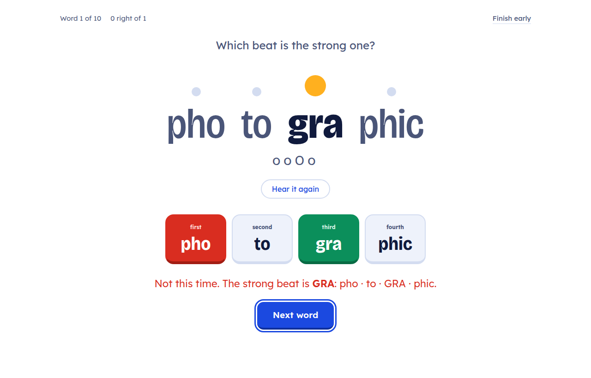

# mr shakir's Say It Right

A classroom game for **pronunciation, word stress and syllables**, built for three
groups at Beginner, Elementary and Pre-Intermediate level. It runs in the browser,
needs no installation and no internet once the page has loaded.

**Play it here:** https://gunjuzone.github.io/say-it-right/



The design follows how stress is taught at the board: syllables are beats, each beat
gets a bubble, and the strong beat is the big one. The answer screen also shows the
`oOo` pattern, so students read the shape of the word as well as the letters.

## The three games

| Game | What students do | Teaches |
|---|---|---|
| **Count the beats** | Hear and see a word, choose how many syllables | Syllable awareness |
| **Find the strong beat** | The word appears in syllables, choose the stressed one | Word stress |
| **Tell the sounds apart** | A sound is shown, for example /iː/ as in "tree", choose the word that has it | Minimal pairs, vowel and consonant contrasts |
| **Mixed** | All three, alternating | Review |

After each answer the word opens into its syllables with the strong beat marked, so
the class sees the pattern rather than only right or wrong. Words that were missed
are listed again on the results screen for drilling.

## Using it in class

- **Projector:** open the page, pick the level, pick the game. Type is large by design.
- **Two teams:** choose "Two teams" and the game alternates turns and keeps both scores.
- **Keyboard:** <kbd>1</kbd>–<kbd>5</kbd> to answer, <kbd>Space</kbd> to hear the word
  again, <kbd>Enter</kbd> for the next question. Useful when the laptop is at the front.
- **Phones:** students can open the same link and play individually. The layout adapts.
- **Audio** uses the browser's built-in voices and prefers a British English voice.
  If a device has no English voice the game still works; the word stays on screen and
  you model the pronunciation yourself.

## Levels

Word lists follow the levels and vocabulary range of *English File*
(Beginner, Elementary, Pre-Intermediate):

- **Beginner:** mostly one and two syllables, plus the common end-stressed words
  learners get wrong (`ho·TEL`, `po·LICE`, `thir·TEEN`).
- **Elementary:** two to four syllables, including the `-teen`/`-NOON` group
  (`af·ter·NOON`, `en·gi·NEER`) against first-stress words.
- **Pre-Intermediate:** three to five syllables and the stress-shift families that
  matter at this level: `PHO·to·graph` / `pho·TO·gra·pher` / `pho·to·GRA·phic`,
  `PO·li·tics` / `po·LI·ti·cal`, `e·CO·no·my` / `e·co·NO·mic`.

Sound pairs use the sound symbols and keywords of the Sound Bank style, for example
/ɪ/ "fish" against /iː/ "tree".

## Editing the word lists

Everything is in `words.js`. Each entry is one word:

```js
{ w: 'banana', syl: ['ba', 'na', 'na'], stress: 1 },
```

- `syl` is the syllable split, and it must spell the word exactly.
- `stress` is the stressed syllable counting from zero, so `1` is the second syllable.

Sound pairs look like this:

```js
{ a: 'ship', b: 'sheep', soundA: ['/ɪ/', 'fish'], soundB: ['/iː/', 'tree'] },
```

To add your own vocabulary from the unit you are teaching, copy a line and change it.
Then check the data:

```bash
node validate.js     # syllable splits spell the word, stress in range, no duplicates
node test.js         # plays a full round in every level and mode
```

`validate.js` exists because a wrong split or stress index would teach the mistake to
the whole class. Run it after editing.

## Running it locally

No build step. Either open `index.html` directly, or serve the folder:

```bash
python3 -m http.server 8000
# then open http://localhost:8000
```

## Files

| File | Purpose |
|---|---|
| `index.html` | The three screens: setup, play, results |
| `styles.css` | Classroom display styling |
| `app.js` | Game logic, scoring, speech, keyboard |
| `words.js` | Word lists and sound pairs, the file to edit |
| `validate.js` | Data checks |
| `test.js` | Plays full rounds in a DOM stub |

## Note

Word lists are organised to match the levels of *English File* so they fit the
syllabus, but this is an independent teaching aid. It is not affiliated with,
authorised by or endorsed by Oxford University Press, and contains no material from
the books.

MIT licensed. Use it, change it, share it with other teachers.
